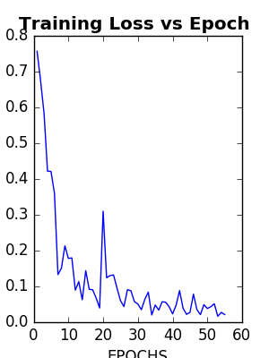
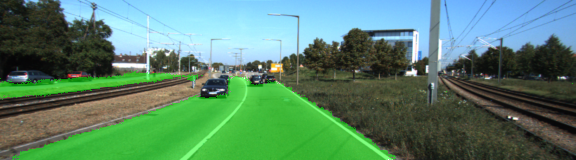
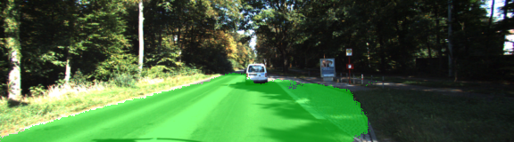
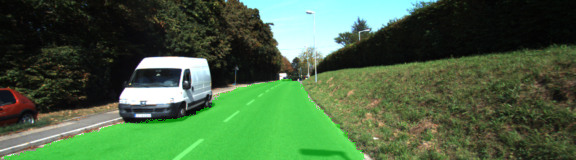

# CarND-Semantic-Segmentation
#### Writeup
--- 

## Introduction

In this project, you'll label the pixels of a road in images using a Fully Convolutional Network (FCN).

## Hyper-parameters

| Parameter | Value |
| --- | --- |
| Keep Probability | .65 |
| Batch Size | 32 |
| Epochs | 55|
| Learning Rate | .0001 |
| Normalization Standard Deviation | .01|

## Results

The training loss starts at 0.756576 for epoch 0 and then continues to decrease over the period of time. At epoch 54 the value is 0.0213626. 

Result Images

